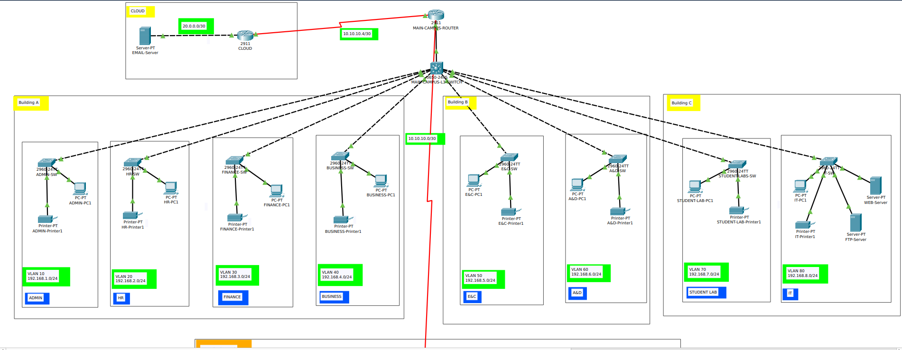
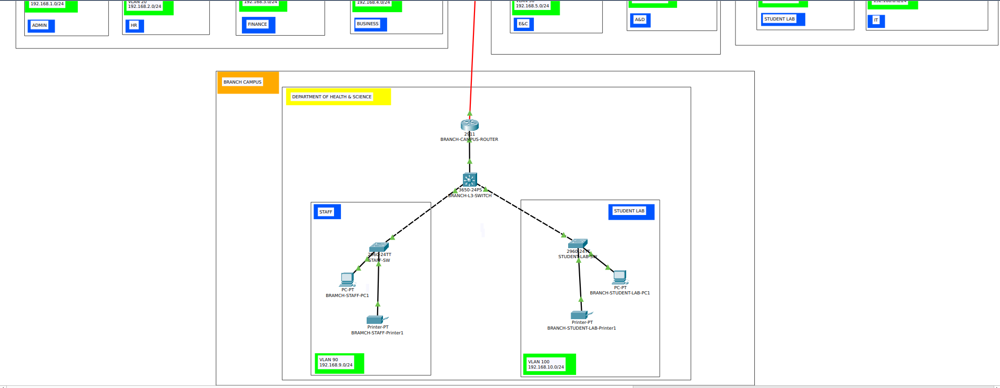
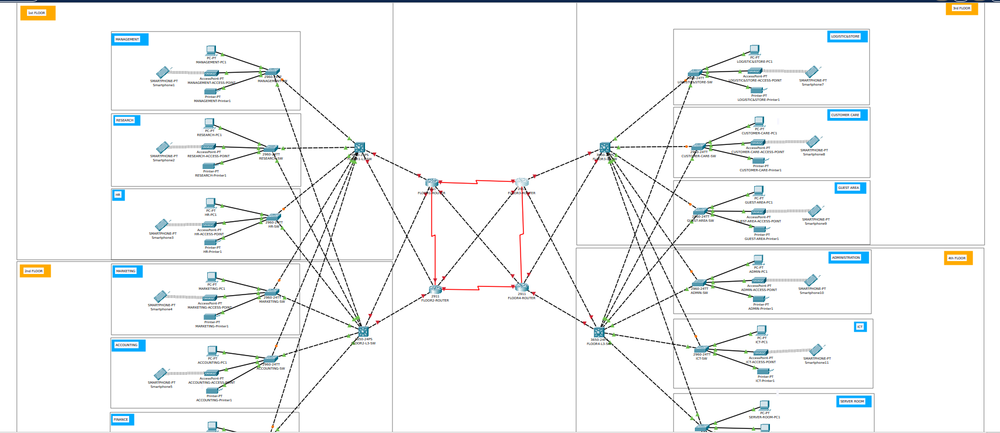
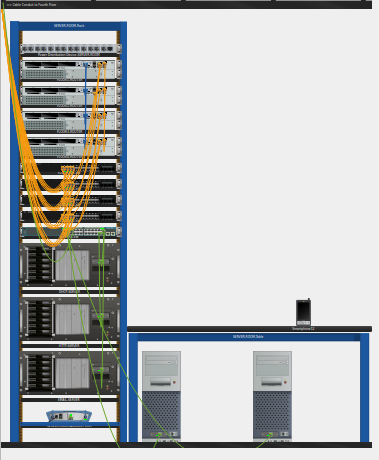

# Network Design Practice Projects

## Project 01

Design a network in CISCO packet tracer to connect `ACCOUNTS` and `DELIVERY` departments through the following:

1. Each department should contain at least `2PCs`.
2. Appropriate number of switches and routers should be used in the network.
3. Using the given network address `192.168.40.0`, all interfaces should be configured with appropriate IP addresses, subnet mask and gateways.
4. All devices in the network should be connected using appropriate cables.
5. Test the connectivity between ACCOUNT and DELIVERY departments. PCs in DELIVERY department `should be able to ping` PCs in ACCOUNTS department.

_Network Design :_

## Project 02 - Simple Company Network

**XYZ company** is a fast-growing company in Eastern Australia with more than 2 million customers globally. The company deals with selling and buying of food items, which are basically operated from the headquarters. The company is intending to open a branch near the local village Bonalbo. Thus ,the company requires young IT graduates to design the network for the branch. `The network is intended to operate separately from the HQ network.`
Being a small network, the company has the following requirements during implementation.

1. One router and two switches to be used.(All CISCO products).
2. 3 departments (`Admin/IT`, `Finance/HR`, `Customer service/Reception`)
3. Each department is required to be in `different VLANs`.
4. Each department is required to `have wireless network` for the users.
5. Host devices in the network are required to obtain `IPv4 address automatically`.
6. Devices in all the departments are required to communicate with each other.

Assume the ISP gave out a base network of `192.168.1.0`, you as the young network engineer who has been hired, design and implement a network considering the above requirements.

_Network Design :_

## Project 03 - Hotel Management Network

As a part of your end year networking project, you are required to design and implement Vic Modern Hotel network. The hotel has `three floors`, in the **first floor** there three departments (`Reception`, `Store`, and `Logistics`), in **second floor** there are three departments (`Finance`, `HR` , and `Sales Marketing`), while the **third floor** hosts the `IT` and `Admin`. Therefore, the following are part of the considerations during the design and implementation.

1. There should be `three routers` connecting each floor (all placed in the server room in IT department).
2. All routers should be connected to each other using `serial DCE cable`.
3. The network between the routers should be
   - 10.10.10.0/30
   - 10.10.10.4/30
   - 10.10.10.8/30
4. Each floor is expected to have one `switch`(placed in the respective floor)
5. Each floor is expected to have `WIFI networks` connected to laptops and phones.
6. Each department is expected to have a `printer`.
7. Each department is expected to be in `different VLAN` with the following details.

#### 1st Floor

    • Reception	- VLAN 80	Network of 192.168.8.0/24
    • Store 	- VLAN 70	Network of 192.168.7.0/24
    • Logistics	- VLAN 60	Network of 192.168.6.0/24

#### 2nd Floor

    • Finance	- VLAN 50	Network of 192.168.5.0/24
    • HR		- VLAN 40	Network of 192.168.4.0/24
    • Sales		- VLAN 30	Network of 192.168.3.0/24

#### 3rd Floor

    • Admin 	- VLAN 20	Network of 192.168.2.0/24
    • IT		- VALN 10	Network of 192.168.1.0/24

8. Use `OSPF` as the routing protocol to advertise routers.
9. All devices in the network are expected to `obtain IP address dynamically` with their respective router configured as the DHCP server.
10. All the devices in the network are expected to communicate with each other.
11. Configure `SSH` in all the `routers` for remote login.
12. In IT department, add PC called Test-PC to port fa0/1 and use it to test remote login.
13. Configure port security to IT-dept switch to allow only Test-PC to access port fa0/1 (Use sticky method to obtain mac-address with violation mode of shutdown)

_Network Design :_

## Project 04 - Campus Network

**Albion University** is a large university which has two campuses situated 20 miles apart. The university’s students and staff are distributed in **4 faculties**, these includes the faculties of `Health and Science`, `Business`, `Engineering/Computing` and `Art/Design`. Each member of staff has a PC and student s have access to PCs in the labs.

Requirements :

1. Create a network topology with the main components to support the followings :

#### Main Campus

##### _Building A_

- Administrative staff in the departments of Management, HR and Finance.
- The admin staff PCs are distributed in the building offices and it is expected that they will share some networking equipment _(Hint: use of VLANs is exptected here)_.
- The Faculty of Business is also situated in this building.

##### _Building B_

- Faculty of Engineering and Computing and Faculty of Art and Design.

##### _Building C_

- Students’ labs and IT department.
- The IT department hosts the university web server and other servers.
- There is also an email server hosted externally on the cloud.

#### Smaller Campus

- Faculty of Health and Science (Staff and students’ labs are situated in separate floors)

2. You will be expected to configure the core devices and few devices to provide end-to-end connectivity and access to the internal servers and external server.

- Each department/Faculty is expected to be on its own `separate IP network`.
- The switches should be configured with appropriate `VLANs` and security settings.
- `RIPv2` will be used to provide routing for the routers in the internal network and static routing for the external server.
- The devices in building A will be expected to acquire dynamic IP address from a router-based `DHCP server`.

_Network Design :_

## Project 05 - Bank Network

**Radeon Company Ltd** is a US-owned company that deals with Banking and Insurance. The company is intending to expand its services across the African continent having the first branch to be located in Nairobi, Kenya. The company has secured a four story building to operate within the Kenyan capital city. Therefore the company would like to allow sourcing the knowledge from a group of final year students from the local university to design and implement the network. Assume you are among the students to take over this role, carefully read down the requirements then model the design and implement the network based on the company’s needs. Each floor has departments as provided in the table below.

| Floor          | Department              | PCs | Printers | Servers |
|----------------|-------------------------|-----|----------|---------|
| First Floor    | Management Department   | 20  | 4        | 0       |
|                | Research Department     | 20  | 4        | 0       |
|                | HR Department           | 20  | 4        | 0       |
|                |                         |     |          |         |
| Second Floor   | Marketing Department    | 20  | 4        | 0       |
|                | Accounting Department   | 20  | 4        | 0       |
|                | Finance Department      | 20  | 4        | 0       |
|                |                         |     |          |         |
| Third Floor    | Logistics & Store       | 20  | 4        | 0       |
|                | Customer care           | 20  | 4        | 0       |
|                | Guest Area              | 40  | 2        | 0       |
|                |                         |     |          |         |
| Fourth Floor   | Administration Department | 20  | 2        | 0     |
|                | ICT Department          | 20  | 2        | 0       |
|                | Server Room             | 2   | 0        | 3       |

#### Requirements :

1. Design software modeling tool to visualize the network topology. (consider requirement 3)

    - Software Modeling Tools : MS Visio, Visual Paradigm, or Draw.io for modeling network design

2. Use any of the following network simulation software to implement the above topology.

    - Simulation Software : `Cisco Packet Tracer` or `GNS3` for design and implementation.
    - There should be one `router` on each floor. The router should be connecting switches on that floor.
    - Use `OSPF` as the routing protocol to advertise routes.
    - Each department is required to have a `wireless network` for the users.
    - Each department except the server room will be anticipated to have around `60 users` both `wired and wireless` users.
    - Host devices in the network are required to obtain `IPv4 addresses automatically`.
    - Devices in all the departments are required to communicate with each other.
    - All devices in the network are expected to obtain an IP address dynamically from the dedicated `DHCP servers` located at the server room.
    - Create `HTTP`, and `Email` servers.
    - Configure `SSH` in all `routers` for remote login.

3. Use hierarchical network design with redundancy included.

    - Having `core`, `distribution` and `access` layers.

4. Configure the basic configuration of the devices.

    - Hostnames
    - Line Console & VTY passwords
    - Banner messages
    - Disable domain IP lookup

5. Each department should be in a different VLAN

    - Create `VLANs` in every department
    - VLANs you will use in your case, including VLAN1 also e.g. 10, 20, 30 … etc.
    - Each VLAN should be a different subnetwork.

6. Planning of IP Addresses

    - You have been given `192.168.10.0` as the base address for this network.
    - Do subnetting based on the number of hosts in every department as provided above.
    - Identify subnet mask. Usable IP range and broadcast address for each subnet.

7. End Devices Configurations

    - Configure all the end devices in the network with appropriate IP address based on the calculations above.

8. Configure port security

    - Use sticky command to obtain MAC address
    - Violation mode of the shutdown

_Network Design :_

_Physical view of the Server Room :_

